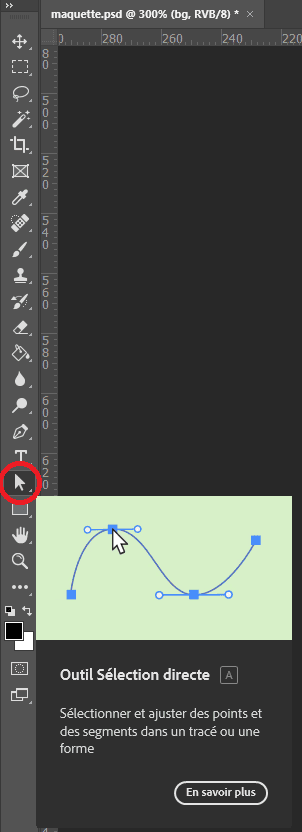
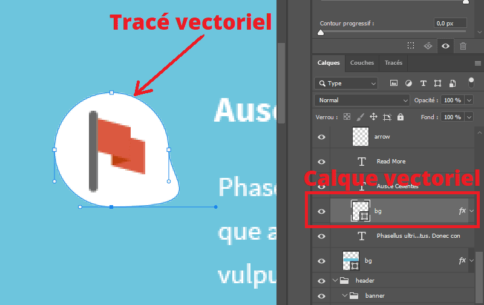
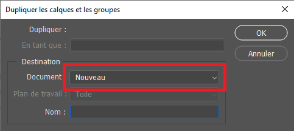

# Intégration Photoshop

Photoshop est un logiciel de retouche d'images et de création graphique. Il est utilisé par les graphistes pour créer des maquettes de sites web, des logos, des affiches, des bannières publicitaires, etc.

Il est encore très utilisé par les designers web pour créer des maquettes de sites web. C'est un outil très puissant qui permet de créer des maquettes très détaillées et complexes.

Aujourd'hui, il est toujours nécessaire pour un développeur Web de savoir utiliser les bases de ce logiciel, et de comprendre les notions de calques, de masques, de transparence, de réglages de couleurs, etc.

> **Note**
>
> Si vous n'avez pas Photoshop d'installé sur votre machine, vous pouvez utiliser le site [https://www.photopea.com/](https://www.photopea.com/) qui propose une version en ligne de Photoshop avec les mêmes fonctionnalités.
> Cet outil est entre-autres capable de lire et d'exporter des fichiers PSD (Photoshop Document).

## La maquette

Afin de vous familiariser avec Photoshop, vous allez travailler sur une maquette fournie avec ce cours. Le fichier se trouve à l'emplacement suivant : `_ressources/maquette.psd`.

Voici un aperçu de la maquette :

  

Si vous avez Photoshop, ouvrez la maquette dans le logiciel, sinon utilisez [www.photopea.com/](https://www.photopea.com/)

---

## Les calques

Photoshop fonctionne sur le principe de calques.

Un calque est une couche transparente qui peut contenir des pixels, du texte, un masque, ou un tracé vectoriel.

  
   
  <i>En rouge, un calque de pixels.</i>

On constate qu'il est possible d'organiser les calques dans des dossiers, et que l'on peut leur rajouter des effets.

Par exemple, le calque nommé `Info` contient des pixels de couleur gris foncé, et dispose d'un effet `Incrustation de motif` qui lui donne un aspect "bois".

Prenez le temps de regarder les différents calques de la maquette, en dépliant les dossiers.

Essayez de repérer les calques correspondants à chaque élément de la maquette.

### Les calques vectoriels

Un calque vectoriel est un calque qui contient un tracé vectoriel, qu'il est possible de modifier à volonté.

Les tracés se modifient avec l'outil `Sélection directe` de la barre d'outils :

  
  
   
  <i>Le calque `bg` contient un tracé, rempli avec la couleur blanche.</i>

## Extraire les éléments depuis un calque

S'il est facile dans Photoshop de retrouver les polices de caractères ou les couleurs, il est parfois plus compliqué d'isoler les images ou icônes.

Afin d'extraire une image depuis un fichier PSD, il faut :

- localiser le calque (ou les calques) contenant l'élément visuel à isoler
- sélectionner les calques (en maintenant la touche `Ctrl` enfoncée)
- faire un clic droit sur la sélection, puis choisir `Dupliquer les calques`
- dans la boîte de dialogue qui s'affiche, choisir comme destination `Nouveau document`
- dans le nouveau document qui s'ouvre, ouvrir le menu `Image > Rognage`
- dans la boîte de dialogue, choisir le rognage des pixels transparents, aux 4 coins.
- enfin, enregistrer le fichier au format PNG via le menu `Fichier > Enregistrer une copie`

Voici quelques images montrant cette procédure :

   
   
   

Et voilà, votre image est enregistrée.

---

# Exercice

Vous allez maintenant intégrer cette maquette en HTML/CSS en utilisant toutes les bonnes pratiques vues jusqu'à présent.

Le but est surtout de manipuler Photoshop et de savoir extraire des éléments pour les intégrer en HTML/CSS.

Bon courage !
