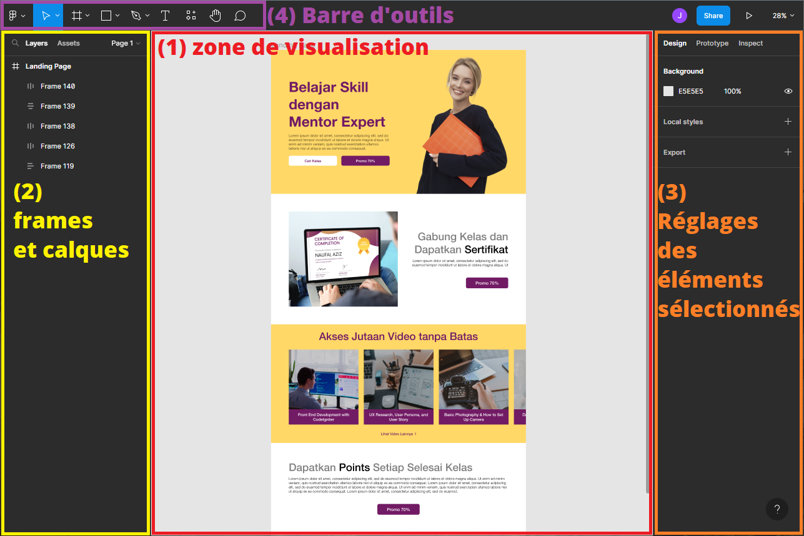
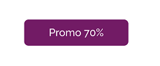

# Intégration Figma

Figma est un outil en ligne qui permet de créer des maquettes de sites web et d'applications. Il est très utilisé par les designers et les développeurs.

Il dispose d'une fonctionnalité de collaboration en temps réel, ce qui permet à plusieurs personnes de travailler sur le même projet en même temps.

De plus, son interface est très intuitive, à la fois pour les créateurs et les intégrateurs Web.

Dans ce chapitre, vous allez travailler sur une maquette de _landing page_.

Cette maquette est disponible à l'adresse suivante :

> ### https://www.figma.com/community/file/1120671124990058692
> (par [@Naufal Aziz](https://www.figma.com/@naufalaziz))

## Analyse de l'interface Figma

L'interface de Figma se décompose en 4 parties majeures :

  

1. La zone de visualisation où s'affiche les éléments graphiques de la maquette.
2. Liste les **pages** de la maquette, et les **frames** qui les composent (les frames sont comparables aux calques de Photoshop).
3. Zone de réglage des propriétés des éléments sélectionnés dans la zone de visualisation (par exemple, les couleurs, les polices, le style de bordure, etc…).
4. La barre d'outils qui permet de sélectionner les différents outils de dessin, mais aussi de créer de nouvelles frames.

---

On peut cliquer sur n'importe quel élément de la maquette pour afficher ses propriétés dans la zone de réglages. Plusieurs double-clicks permettent d'aller plus loin dans la hiérarchie des éléments :

  

Essayez de changer des éléments de la maquette, comme la couleur de fond, la couleur du texte, la police de caractères, etc…

## Les components

Figma permet de créer des **components** qui sont des éléments réutilisables dans la maquette.

Par exemple, on peut créer un component pour un bouton, et l'utiliser plusieurs fois dans la maquette.

Remarquez que la maquette comporte plusieurs fois le même bouton violet :

  

1. Convertissez ce bouton en component en sélectionnant l'élément, puis en faisant un clic droit sur la frame, puis `Create Component`

2. Supprimez les autres calques du bouton, et remplacez-les par le component.

---

# Exercice

Vous allez maintenant intégrer cette maquette en HTML/CSS en utilisant toutes les bonnes pratiques vues jusqu'à présent.

Le but est surtout de manipuler Figma et de savoir extraire des éléments pour les intégrer en HTML/CSS.

Bon courage !
